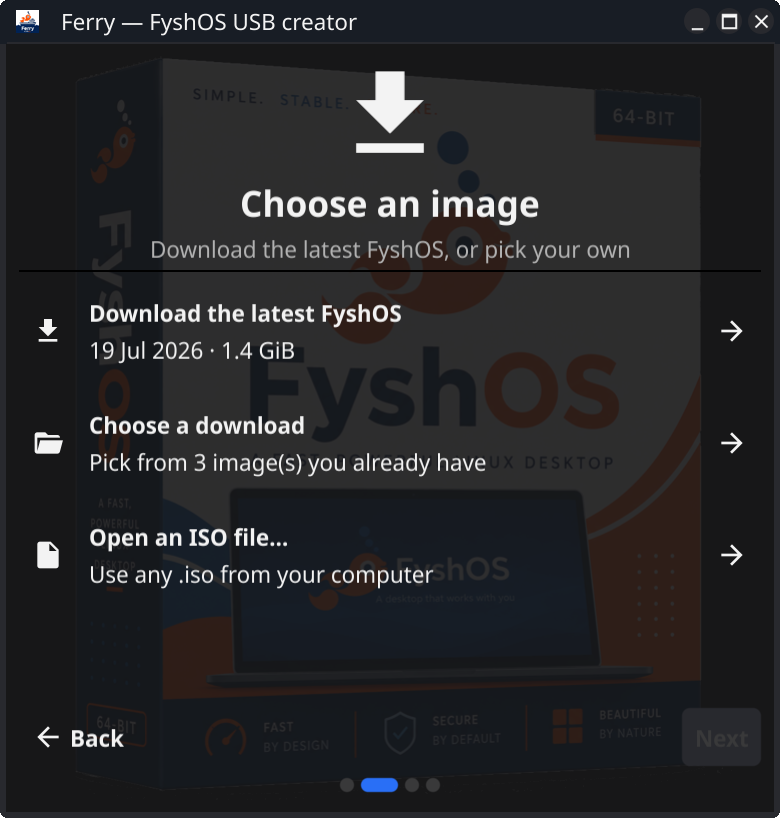

# Ferry

A friendly USB creator for [FyshOS](https://github.com/FyshOS/fyshos). Ferry downloads
the latest FyshOS image and writes it to a USB stick, verifying the result and confirming output.



## Features

- **Fetches the latest release** directly from the FyshOS GitHub releases, matched to
  your architecture (amd64, arm64 or i386).
- **Reuses what you already downloaded** — images are cached, so a second stick costs
  no bandwidth.
- **Writes any ISO**, not just FyshOS, if you already have one on disk.
- **Verifies after writing.** Ferry reads the device back and compares its SHA-256
  against the source image, so a bad stick is reported rather than discovered at boot.
- **Turns the leftover space into storage.** When writing an **amd64** image **on Linux**
  to a stick with room to spare, Ferry can add an exFAT **data partition** (labelled
  `Data`) in the free space after the image, so your files persist across reboots and are
  readable on Linux, macOS and Windows.

## Installing

Ferry is a Go application built with [Fyne](https://fyne.io).

```
go install fyne.io/tools/cmd/fyne@latest
fyne install github.com/fyshos/ferry@latest
```

Or build from a checkout:

```
git clone https://github.com/fyshos/ferry.git
cd ferry
fyne install
```

## Requirements

Writing to USB media is supported on **Linux** and **macOS**. Ferry builds on other
platforms but will report that device writing is unsupported.

Ferry shells out to a few standard utilities, all present on a typical desktop install:

| | Linux | macOS |
| --- | --- | --- |
| listing removable devices | `lsblk` | `diskutil`, `mount` |
| requesting administrator rights | `pkexec` | `authopen` |
| writing and flushing | `dd`, `sync`, `blockdev` | done in-process |
| verifying | `sha256sum` | done in-process |
| data partition (optional, Linux only) | `sgdisk`, `mkfs.exfat` | — |
| finishing up | `eject` or `udisksctl` | `diskutil eject` |

The data-partition step is optional, so its tools are only needed if you ask for one.
Install `gdisk` (for `sgdisk`) and `exfatprogs` (for `mkfs.exfat`) if they are missing.

On Linux, `pkexec` needs a polkit authentication agent running in your desktop session.
Most desktops start one automatically; if the authorisation prompt never appears, that
agent is the thing to check.

On macOS Ferry works from an ordinary non-administrator account. The privileged step is
only the *open*: `/usr/libexec/authopen` presents the system authorization dialog for writing.

## How it works

Ferry is a four step wizard:

1. **Architecture** — pick the CPU the target machine uses. Defaults to your own.
2. **Image** — download the latest FyshOS, pick one you already have, or open any `.iso`.
3. **Device** — choose from the removable drives Ferry found.
4. **Confirm & write** — a last look before anything is overwritten, then write and verify.
   When the stick has space to spare, this step also offers to turn the remainder into an
   exFAT data partition.

Downloads land in the application cache directory and are written to a `.part` file that
is only renamed into place on success, so an interrupted download never masquerades as a
complete image.

On Linux the write runs as a single privileged shell script under `pkexec`: it unmounts
any mounted partitions, `dd`s the image across, flushes the device's buffer cache, reads
back exactly as many bytes as the image is long, and compares checksums, streaming
progress back to the UI as it goes.

On macOS the same sequence happens in-process. `diskutil` unmounts the disk (no privileges
needed for external media), `authopen` returns the raw device descriptor, and Ferry copies
the image through it in block-aligned chunks — hashing as it streams, so verification
costs no second read of the source — then reads the media back and compares. Progress
comes straight from the byte counter.

The optional data partition is always added **after** the image is written and verified,
so it can never put a good write at risk: if anything about the partition step fails, Ferry
reports it as a warning and the verified FyshOS image still ships. The image is written to
the whole device first — that lays down its own partition table — and the data partition is
then appended into the free space that follows it (`sgdisk` to add the partition,
`mkfs.exfat` to format it), all folded into the same privileged step as the write.

## Safety

Writing an image **erases the entire target device**. Ferry only lists removable,
hotpluggable or USB-attached drives — your system disk will not appear — and the
confirmation step shows the device's model, path and size. It still cannot know which
stick matters to you, so check those details before you continue.

Once writing starts it cannot be cancelled: there is no safe midpoint to stop a
half-written device at. Leave the stick plugged in until Ferry says it is done.
